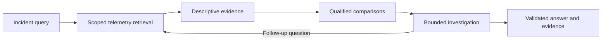

# SemanticRCA

SemanticRCA is a [MantisGrid Hackathon 2026 Track 1](https://github.com/MantisGridAI/hackathon-2026-official/tree/main/track-1) project exploring structured, source-linked telemetry evidence for infrastructure root-cause investigation. It separates deterministic evidence preparation from a bounded investigation loop, aiming to explain when a failure began, which component caused it, and why.

**Current checkpoint:** the default three-flag runner selects `agents.routed`, which combines source-backed discovery with bounded GLM calls and a low-confidence best-guess fallback. The offline demo also connects baseline comparisons, trace semantics, and a scripted investigation. Full benchmark accuracy, routed-versus-single-model diagnosis evaluation, and cold 20-case resource limits remain unverified. Earlier documents and commands use the name **SymbolicRCA**.

## The challenge

Track 1 asks for an unattended agent that investigates production microservice telemetry with injected faults. The telemetry is too large to fit in a model context, so the agent must retrieve relevant evidence. Development uses 70 cases from Market-cloudbed-1; judging uses 20 cases from another deployment.

The official brief asks teams to build three things:

- **An agent** that infers the requested failure time, component, and reason from telemetry.
- **An evaluation** comparing at least two configurations, including routed and single-model operation.
- **An explanation** for each case, backed by raw telemetry and explicit about uncertainty and alternatives.

See the [official data guide](https://github.com/MantisGridAI/hackathon-2026-official/blob/main/track-1/docs/data.md) and [scoring guide](https://github.com/MantisGridAI/hackathon-2026-official/blob/main/track-1/docs/scoring.md). These define the benchmark; the synthetic demo below exercises the project's evidence flow.

## Our approach



Deterministic operations retain measurements, identities, recorded structure, and source pointers. Trace semantics give known operations descriptive names while retaining unknown meanings. Comparisons use eligible reference observations and record limitations. The investigation uses these records to consider hypotheses and request focused follow-up evidence.

A deviation is evidence to investigate; it does not establish a cause. Recorded ancestry does not prove a causal relationship, and an unknown operation remains unknown. The intended final answer preserves supporting observations, uncertainty, alternatives, and the reason the investigation stopped.

The [execution architecture](docs/architecture.md) describes the target system. The [trace semantics library](libraries/trace_semantics/README.md) and [investigation library](libraries/rca_domain/README.md) document the implemented domain interfaces and their current limits.

## Try the demo

From the repository root, with **Python 3.12**, choose a new or empty output directory:

```bash
python3.12 scripts/demo_discovery.py --out /tmp/semanticrca-demo
```

Open `/tmp/semanticrca-demo/demo.md`. No package installation, credentials, or network access are needed.

The command creates a synthetic query and eight telemetry families, runs the discovery CLI and artifact validator, and connects the same evidence to baseline comparison and investigation code. The report links source-backed findings, targeted logs, semantic descriptions, comparison results, and the investigation receipt.

In the authored example, a frontend request has duration 300 against reference requests with duration 100, and a separate resource measurement departs from its reference observations. The scripted investigation performs two assessments and one follow-up operation. Its component answer demonstrates evidence handoff and control flow; it does not establish root cause or measure diagnosis accuracy. Discovery predictions remain blank and model usage is zero.

See the [combined demo guide](docs/demo-discovery.md) and [richer baseline demo](docs/demo-baseline-comparison.md).

### What works today

| Area | Current behavior |
|---|---|
| Default runner | Runs `agents.routed`; writes requested incident fields, evidence and usage. Explicit `agents.submission` retains the placeholder regression mode. |
| Telemetry discovery | Optional `agents.discovery` path; exercised by the combined synthetic demo. |
| Trace semantics | Deterministic descriptions, raw evidence retention, and local deferral of unknown meanings. |
| Baseline comparisons | Authored demonstrations of qualified references and comparative descriptors. |
| Investigation | Injected scripted assessor and deterministic follow-up operations with bounded attempts. |
| Live models | GLM submission adapter with bounded retries/fallback; separate Featherless experiments. Full diagnosis accuracy remains unverified. |
| Benchmark evaluation | Routed versus single-model diagnosis results are not yet reported. |

## Run the official interface

Download and prepare the benchmark bundle using the [official data instructions](https://github.com/MantisGridAI/hackathon-2026-official/blob/main/track-1/GET_DATA.md). The bundle contains `query.csv` and dated telemetry folders for metrics, logs, and traces. Development labels belong in evaluation, outside inference.

The repository preserves the official CLI shape:

```bash
python3.12 run.py \
  --dataset /absolute/path/to/bundle \
  --queries /absolute/path/to/bundle/query.csv \
  --out /absolute/path/to/empty-output
```

The default agent is `agents.heuristic`, which delegates to the empty-output stub. Append `--agent agents.discovery` to exercise discovery; diagnosis remains pending on that path. Resume is unsupported. For a small offline I/O example, see the [harness guide](docs/demo-harness.md).

### Container

Build from the repository root:

```bash
docker build -t semanticrca .
```

With `FEATHERLESS_API_KEY` set in the host environment and an existing empty output directory, the official invocation is:

```bash
docker run --rm \
  --cpus=2 --memory=8g \
  -e FEATHERLESS_API_KEY \
  -v /absolute/path/to/bundle:/data:ro \
  -v /absolute/path/to/empty-output:/out \
  semanticrca \
  python run.py --dataset /data --queries /data/query.csv --out /out
```

The current default stub makes no model calls and needs no key. For the completed live agent, the official contract requires `FEATHERLESS_API_KEY`, honors `FEATHERLESS_BASE_URL` when supplied, and otherwise defaults to `https://api.featherless.ai/v1`. Forward a custom endpoint with `-e FEATHERLESS_BASE_URL`. Judging permits network access only to that configured endpoint; inputs are read from `--dataset` and outputs written to `--out`.

### Outputs

| Artifact | Meaning |
|---|---|
| `predictions.csv` | One row per original `row_id`. Currently blank; the final agent must emit the requested incident fields. |
| `evidence/<row_id>.md` | `Answer`, `Confidence`, `Evidence`, and `Ruled out` sections. The default stub marks diagnosis unimplemented. |
| `usage.jsonl` | Per-case time and model usage. The offline paths record zero model calls/tokens. |

The final answer must preserve the requested failure count, exact component/reason names, and required key ordering. Benchmark timestamps use UTC+8 with a 60-second scoring tolerance. The official rules require a best guess with honest uncertainty in the explanation. Blank scaffold outputs do not fulfill that diagnosis requirement.

See the [official submission contract](https://github.com/MantisGridAI/hackathon-2026-official/blob/main/track-1/docs/submission.md) for the authoritative invocation and artifact requirements.

## Model routing and runtime budgets

Track 1 requires per-call routing within the `zai-org/*` GLM family on Featherless. The intended design uses deterministic preparation to reduce the evidence sent to models, then reserves model calls for interpretation and investigation. Integrated routing, provider fallback, and cost enforcement remain unfinished. The investigation library bounds callback attempts; those bounds do not forcibly interrupt callbacks or establish hard time limits.

The [official model guide](https://github.com/MantisGridAI/hackathon-2026-official/blob/main/track-1/docs/models.md) specifies:

| Resource | Official limit |
|---|---|
| Machine | 2 CPUs, 8 GB RAM, no GPU |
| Per case | $3 and 10 minutes |
| Whole judged run | $25 and 20 minutes for 20 cases |

The total time allowance averages one minute per case. The completed agent needs bounded retries, fallback within the model family, and enough reserved capacity to persist answers when investigation stops. Current zero-call demo usage is not evidence of effective cost-efficient diagnosis.

## Evaluation and results

The combined offline demo exercises artifact validation and evidence handoffs on authored data. It does not measure held-out diagnosis accuracy, real-data throughput, or routing savings. [REPORT.md](REPORT.md) and [eval/](eval/README.md) currently cover the earlier empty-output harness milestone.

The planned comparison holds the agent and cases fixed while comparing routed and single-model configurations. Report strict and partial accuracy, dollars and seconds per case, repeat-run variance, and failure patterns, with evidence reviewed against source telemetry. Keep labels isolated from inference and distinguish development results from generalization to another deployment.

The [official scoring guide](https://github.com/MantisGridAI/hackathon-2026-official/blob/main/track-1/docs/scoring.md) explains evaluator edge cases and comparison expectations. The [participant agreement](https://github.com/MantisGridAI/hackathon-2026-official/blob/main/PARTICIPANT_AGREEMENT.md) governs judging weights.

## Development and remaining work

| Path | Purpose |
|---|---|
| `run.py`, `agents/` | Submission entry point and selectable agents. |
| `rca/` | Scope, telemetry discovery, comparison, and output code. |
| `libraries/` | Standalone trace semantics and investigation domains. |
| `scripts/`, `tests/` | Demonstrations, validators, and checks. |
| `experiments/` | Isolated research and live-model studies. |
| `docs/`, `specs/` | Architecture, decisions, research, and implementation requirements. |
| `eval/`, `REPORT.md` | Evaluation fixtures and reporting. |

Run the repository's unittest checks:

```bash
PYTHONDONTWRITEBYTECODE=1 python3.12 -m unittest discover -s tests -v
```

Library-specific checks are documented in their READMEs. Passing a check establishes its tested contract, not full benchmark readiness.

Remaining work is to integrate a live diagnoser with final answer persistence; complete routing, fallback, and runtime budget enforcement; harden retrieval and comparisons on real data; and run repeated routed versus single-model evaluations and a constrained container rehearsal. The [future-work notes](docs/hackathon-future-work.md) provide additional context.

## Attribution and AI disclosure

The project targets the [official MantisGrid hackathon repository](https://github.com/MantisGridAI/hackathon-2026-official). Track 1 telemetry comes from OpenRCA (Xu et al., ICLR 2025), sourced from the AIOps Challenge series. See the organizers' [attribution and dataset license notes](https://github.com/MantisGridAI/hackathon-2026-official/blob/main/ATTRIBUTION.md), which identify CC BY-NC 4.0 for Track 1 data.

Human-provided requirements and review direction guide the project. OpenAI Codex has been used for planning, implementation, review, and documentation. The earlier harness milestone records implementation subagents using OpenAI `gpt-5.6-luna` with `xhigh` reasoning; its code, tests, and documentation were AI-generated under human direction. This README was also drafted with Codex. That record does not establish individual authorship for every later change.

The current offline runtime uses Python's standard library and custom agent/domain code, with no external agent framework or model SDK required. Separate live semantic experiments use `zai-org/GLM-5.3-Flash` on Featherless through the OpenAI-compatible SDK; see the [experiment documentation](experiments/semantic_encoding_v1/README.md). Those experiments are separate from the default submission runner.
