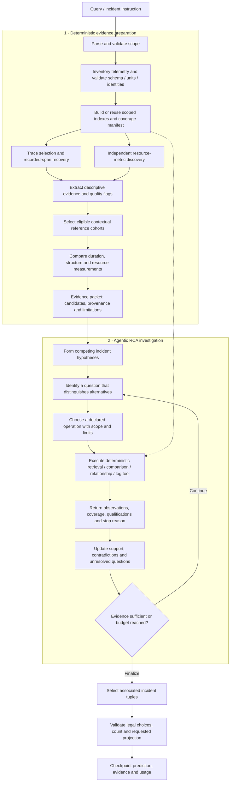

# SymbolicRCA execution architecture

Date: 2026-09-17. Status: target architecture, grounded in the accepted ADRs and
feature specifications; not a claim of implemented or validated diagnosis.

SymbolicRCA separates deterministic evidence preparation, bounded agentic
investigation, and validated answer assembly. The agent decides which question
to investigate next. Deterministic operations control access to telemetry,
measurements, comparisons, and provenance.

## Execution flow

## 1. Deterministic preparation

1. **Interpret the instruction before telemetry access.** Preserve the original
   row identity and derive deployment, UTC+8 time bounds, requested fields, and
   failure count with text support. Conflicting or unsupported scope fails
   explicitly; optional metadata is only a consistency check.
2. **Inventory and prepare the required sources.** Discover resource identities,
   KPIs, schemas and timestamp conventions from the supplied bundle. Retain raw
   values and qualify uncertain duration units. Build reusable indexes beneath
   `--out`, with source fingerprints, extraction versions and build completeness.
   Prepare only the sources required by declared scope and policy; indexing all
   modalities up front is not a prerequisite.
3. **Retrieve observations through independent trace and metric paths.** Select
   traces by scope and recover their available recorded spans across the source
   snapshot, including boundary-crossing records. Resource discovery must remain
   available when frontend latency is normal or traces are unavailable.
4. **Extract descriptive evidence.** Preserve execution structure, measurements,
   counts, temporal relations, exact identities, uncertainty and source locators.
   Versioned symbolic representations may compress repeated structure under a
   declared fidelity contract. Unknown meanings and unresolved targets remain
   explicit; descriptive symbols do not assert anomaly or cause.
5. **Compare against eligible contextual references.** Freeze reference and
   comparison policies for the investigation. Keep duration deviations,
   structural differences and metric findings distinct. Sparse, incompatible,
   zero or otherwise unsupported references yield qualified or unavailable
   comparisons, never fabricated scores. Typical behavior is not verified health.
6. **Produce the initial evidence packet.** Prioritize candidates with explicit
   rationale and retain coverage, unavailable findings and limitations. Candidate
   count is independent of the query's requested incident count.

## Evidence and operation boundaries

These are conceptual contracts; concrete signatures remain owned by feature plans.

| Boundary | Required information |
|---|---|
| Investigation scope | Original instruction/row, deployment, time bounds, requested projection, failure count, extraction support |
| Evidence packet | Observations, qualified comparison findings, candidates, supported resource relationships, source pointers, coverage and limitations |
| Operation request | Discriminating question, declared operation, bounded scope, source/policy identities, remaining limits |
| Operation result | Structured observations, provenance, coverage, qualifications, elapsed time, outcome and stop reason |
| Hypothesis | Associated onset/component/reason, supporting and contradicting observations, alternatives, unresolved questions |
| Final case result | Selected incident tuples, requested projection, evidence adequacy, best-guess qualifications, usage and completion/failure status |

Observations, comparison findings, hypotheses and final selections remain separate
records. An LLM annotation cannot rewrite measurements, change the codebook or
resolve an unknown resource without evidence. Repeated views of the same source
observation do not become independent corroboration.

## 2. Agentic investigation

The initial packet seeds competing hypotheses. On each iteration, the agent
identifies an evidence gap, chooses one bounded operation, inspects its result,
and updates the hypotheses. Follow-up work can retrieve narrower telemetry,
compare an eligible cohort, expand a time-supported resource relationship, or
inspect logs for a specific question. Tools use the same deterministic evidence
layer as preparation; adaptive focus does not authorize threshold tuning or an
unrestricted generated-code executor.

For example, a service slowdown may suggest either one replica's resource
pressure or a shared dependency problem. The next operation compares replica
measurements and supported dependency observations in the relevant interval.
The result may support one account, contradict both, or leave identity and
coverage unresolved. Temporal coincidence, downstream position or one large KPI
deviation alone does not establish causation.

Log every attempted operation, including rejected, failed, empty and truncated
requests. Distinguish a valid empty selection from invalid arguments, missing
sources and exhausted limits. Bound retries and repairs. Stop when evidence is
sufficient under the diagnosis policy or when the remaining budget requires
finalization; retain unresolved alternatives either way.

## 3. Answer assembly and runtime controls

Preserve each incident's associated `(occurrence_time, component, reason)` tuple.
Observed behavior onset and inferred fault onset are distinct. Resolve component
names from identity evidence and select reasons from the governing Track 1
vocabulary, then validate the requested count and field projection.

Valid judged cases with legal answer choices require a best guess even when
evidence is weak or the provider budget is exhausted. Mark weak selections
explicitly and never invent observations, exclusions or independent incidents
to justify the answer count. Unsupported scope or impossible legal assembly
produces an explicit failed case with blank prediction and nonzero overall
status, not a successful diagnosis.

Preparation, retrieval, comparisons and model calls share declared case/run
budgets with a finalization reserve. Retain completed case checkpoints after
later failures. Reuse prepared evidence only for compatible source, deployment,
extraction and policy identities; keep each query's scope and answer projection
separate. Deterministic replay applies to fixed inputs/policies and recorded
model observations; live model variability remains measurable.

Inference reads only permitted supplied inputs. Labels and scoring stay in an
isolated evaluation stage after predictions are sealed. Output completion,
evidence fidelity and held-out diagnostic correctness are separate checks.

## Implementation status and ownership

The shipped runtime is the [empty-output harness](../README.md). Experimental
extraction/indexing code supplies starting points, not certified implementations
of this full architecture. The current [feature 004 plan](../specs/004-prompt-anomaly-integration/plan.md)
covers prompt input and interpretation only; this document does not expand it.

| Area | Governing specification or decision |
|---|---|
| Descriptive representation and trace extraction | [Feature 001](../specs/001-candidate-recall-experiment/spec.md), [Feature 005](../specs/005-track1-trace-extraction/spec.md), [ADR 0002](adr/0002-descriptive-semantic-compression.md), [ADR 0010](adr/0010-faceted-semantic-labeling.md) |
| Retrieval, references and resource relationships | [Feature 003](../specs/003-contextual-telemetry-evidence/spec.md), ADRs [0003](adr/0003-indexed-telemetry-retrieval.md), [0004](adr/0004-qualified-contextual-baselines.md), [0005](adr/0005-evidence-backed-resource-relationships.md) |
| Qualified short-window frontend baselines | [Feature 009](../specs/009-qualified-short-baselines/spec.md), [ADR 0013](adr/0013-qualified-short-window-frontend-baselines.md) |
| Reference-relative comparative descriptors | [Feature 010](../specs/010-comparative-descriptors/spec.md), [ADR 0014](adr/0014-reference-relative-comparative-descriptors.md) |
| Deterministic scope and discovery | [Feature 004](../specs/004-prompt-anomaly-integration/spec.md), [ADR 0006](adr/0006-bounded-investigation-operations.md) |
| Agentic diagnosis and evaluator compatibility | [Feature 007](../specs/007-evidence-backed-diagnosis/spec.md), ADRs [0007](adr/0007-evidence-backed-incident-diagnosis.md), [0008](adr/0008-isolated-evaluator-compatibility.md) |
| Runner, provider/routing restrictions and final release | [Feature 002](../specs/002-final-demo-runner/spec.md) |

Validate incrementally: scope correctness, retrieval/provenance fidelity,
representation fidelity, comparison eligibility, bounded operation behavior,
diagnosis contract and isolated scoring, then held-out accuracy/evidence/cost/time.
Successful early-stage checks do not establish later-stage effectiveness.
