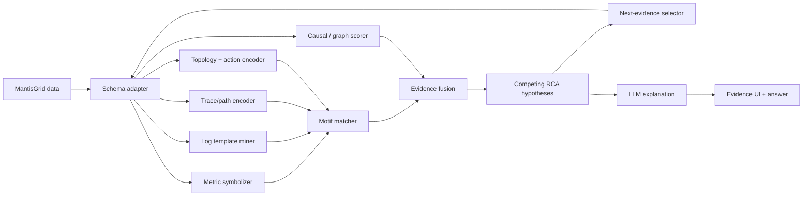
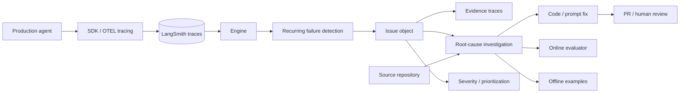
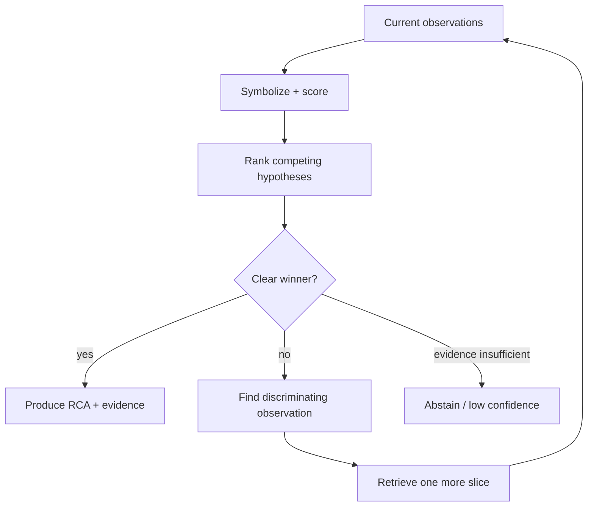

# Open-Source RCA and Agentic Trace-Observation Systems for a MantisGrid Reliability-Ecologist Prototype

## Executive summary

The strongest conclusion from the landscape is that **there is not yet one open-source system that does exactly what we want**: ingest infrastructure metrics, logs, distributed traces and topology; recognize recurring cross-modal behavioral motifs; distinguish downstream symptoms from likely causal origins; and then run an agentic evidence-gathering loop over competing root-cause hypotheses.

Instead, the useful pieces exist in several adjacent ecosystems.

**LangSmith Engine is the best current reference architecture for the *workflow*, but not the best implementation dependency.** Engine continuously analyzes AI-agent production traces, groups recurring failures into issues, attaches evidence, reasons over source code when available, proposes fixes, and generates evaluators or dataset examples to prevent recurrence. Its architecture is explicitly agentic: LangChain describes it as an orchestrator using specialized components to turn trace populations into actionable issues. But Engine is a commercial LangSmith capability rather than an open-source RCA engine; it is focused on **AI-agent traces**, currently runs on a six-hour schedule, does not allow bring-your-own-model for Engine, and its programmatic Issues Agent endpoint is still beta. citeturn19search1turn19search8turn19search17

That makes the transferable LangSmith lesson:

> **screen cheaply → detect recurrence → form an issue → gather discriminating evidence → localize likely cause → produce a durable test**

rather than “use LangSmith to solve the MantisGrid problem.”

The most useful open-source building blocks are complementary:

| Role in our prototype | Best jumping-off point | Why |
|---|---|---|
| AIOps agent environment / practice gym | [Microsoft AIOpsLab](https://github.com/microsoft/AIOpsLab) | Closest research framework to the actual problem: Kubernetes microservices, injected faults, workloads, metrics/logs/traces, agent evaluation |
| Metric/topology RCA | [Salesforce PyRCA](https://github.com/salesforce/PyRCA) | Purpose-built RCA algorithms over multivariate metrics and causal graphs |
| Explicit causal reasoning | [DoWhy](https://github.com/py-why/dowhy) | Strong causal-graph machinery when we can construct a credible dependency/causal graph |
| Log → symbolic-event conversion | [Drain3](https://github.com/logpai/Drain3) | Streaming log-template mining; nearly ideal for turning noisy logs into the alphabet needed by our motif recognizer |
| End-to-end Kubernetes RCA reference | [KubeRCA](https://github.com/kube-rca/kuberca) | Alertmanager → Kubernetes/Prometheus/Tempo → LLM RCA → incident store/UI; closest operational implementation |
| Behavioral diagnosis architecture | [Microsoft AgentRx](https://github.com/microsoft/AgentRx) | Useful model for step-level validation, constraint violations and failure localization, despite targeting AI-agent trajectories rather than infrastructure |
| Agent trace observability | [OpenLIT](https://github.com/openlit/openlit), [Phoenix](https://github.com/Arize-ai/phoenix), [Langfuse](https://github.com/langfuse/langfuse) | Useful for observing **our RCA agent**, not for doing infrastructure RCA itself |

AIOpsLab is MIT-licensed Python and explicitly exists to design, develop and evaluate autonomous AIOps agents; it can deploy microservice environments, inject faults, generate workloads and export telemetry. fileciteturn2file0L1-L13 fileciteturn3file0L1-L2 PyRCA is BSD-3-Clause Python and supplies metric-based RCA, causal discovery, Bayesian inference, random walk, RCD, hypothesis testing and graph-aware root-cause ranking. fileciteturn4file0L1-L13 fileciteturn5file0L1-L5 KubeRCA is Apache-2.0 and already demonstrates the operational flow from Alertmanager through Kubernetes/Prometheus/Tempo context to LLM-assisted RCA. fileciteturn9file0L1-L13 fileciteturn10file0L1-L5

For the hackathon, however, I would **not assemble these into a large platform**. The official challenge gives only 5½ hours and specifically asks Track 1 teams to build an “accurate and efficient agent” over real metrics, traces and logs plus labeled incidents. fileciteturn0file2 fileciteturn0file3 That dramatically favors a **thin custom Python pipeline** using selected libraries over deploying AIOpsLab, KubeRCA, Langfuse or a full OpenTelemetry observability stack.

The architecture I would prebuild is:



The **novel layer** is the Reliability Ecologist: instead of recognizing only `OOM`, `network fault`, or `bad configuration`, recognize higher-order episodes such as **failover stampede**, **premature recolonization**, **coupled-controller oscillation**, **shared-fate concentration**, and **cascade propagation**. That directly extends the Reliability Ecologist concepts from the divergent exploration, which were about interacting controllers and fleet-wide emergent dynamics rather than individually broken components. fileciteturn0file1

The earlier trace-review research characterized this broader transformation as **causal compression**—many observations becoming a small number of evidence-backed issues and likely causes. fileciteturn0file0 The hackathon prototype can make that idea concrete for infrastructure:

> **continuous multisensor telemetry → symbolic behaviors → fused recurring motifs → causal hypotheses → targeted observation → root-cause answer**

That is both more differentiated and more achievable than trying to reproduce a general-purpose AIOps platform.

## LangSmith Engine as the reference architecture

LangSmith now contains two related but distinct things: a broad observability/evaluation platform for agent traces, and **Engine**, an active agent that reasons over populations of those traces.

The important distinction is that Engine is not merely a trace viewer. LangChain says Engine analyzes production traces, clusters related traces into issues, prioritizes them, identifies what needs to change, writes prompt/code modifications, and can open a GitHub pull request when connected to a repository. It then proposes online evaluators and offline examples designed to catch recurrence. citeturn19search1turn19search10

### What the Engine architecture tells us

LangChain's technical description says Engine itself is an **agent orchestrator with specialized components**. Its three jobs are to find recurring failures, convert them into actionable issues, and convert those issues into durable improvements. It pulls traces, optionally reads code, groups failures, proposes evaluators and dataset examples, and updates its representation of the application over time. citeturn19search17

Its central data product is therefore not the raw trace. It is an **issue object** containing a failure pattern, evidence traces, category, severity, proposed actions and metadata. citeturn19search17

Conceptually:



This is strongly analogous to the architecture we want. Replace “agent tool calls” with infrastructure events and the basic transformation becomes:

```text
LangSmith
many agent traces
→ recurring behavioral issue
→ evidence
→ likely failure mechanism
→ fix/evaluator

Reliability Ecologist
many telemetry streams
→ recurring system-behavior motif
→ evidence
→ likely causal mechanism
→ RCA/test
```

That is the most useful thing to steal from Engine.

### Trace ingestion, APIs and SDKs

The public LangSmith API permits direct trace creation through `POST`/`PATCH /runs`, although LangChain recommends its Python or TypeScript SDKs because they batch and background trace transmission rather than adding synchronous tracing overhead. citeturn19search9 The public `langsmith-sdk` repository is MIT-licensed and primarily Python at the repository level. fileciteturn1file0L1-L13

LangSmith also accepts OpenTelemetry trace data. For example, its documented Temporal integration uses native OTel interceptors to preserve distributed workflow/activity/LLM tracing, and its AutoGen integration uses an OTel span processor to send multi-agent traces into LangSmith. citeturn19search4turn19search2

The programmable Engine-side interface is less mature. LangSmith exposes a beta API for creating an Issues Agent for a tracing session:

```text
POST /v1/platform/sessions/{session_id}/issues-agent
```

The response exposes scheduling/run information and the request can contain repository and priority configuration, but LangChain explicitly marks the endpoint as active-development beta. citeturn19search8

### Observation model

LangSmith's observation model is predominantly **agent execution tracing**, not general infrastructure observability. Engine's documented evidence includes production agent traces, failures, evaluator results, unusual behavior and source-code context. Its integrations show OTel being used to represent workflows, activities, LLM calls and agent interactions. citeturn19search1turn19search2turn19search4

That distinction is critical for MantisGrid. OpenTelemetry compatibility does **not** mean Engine is documented as a generic Prometheus-metrics + Kubernetes-events + node-logs + GPU-telemetry RCA engine. The public Engine documentation consistently describes its subject as AI-agent traces. This is an inference from the documented interface and use cases, rather than a claim that the underlying LangSmith storage could never hold custom attributes. citeturn19search1turn19search17

### Cost, licensing and operational constraints

LangSmith's current Developer plan includes up to 5,000 base traces per month but **does not include Engine**. Plus costs $39 per seat per month, includes up to 10,000 base traces and access to Engine, with Engine usage billed separately in LangChain Compute Units. One LCU is currently $1.50, and LangChain estimates approximately 5–30 LCUs for an Engine run depending on trace volume, application complexity, issues and fixes. Engine is scheduled once every six hours. Enterprise adds custom pricing and self-hosted/hybrid options. citeturn19search0

The **SDK is MIT**, but that should not be confused with Engine itself being an open-source framework: Engine is a commercial LangSmith product capability. fileciteturn1file0L1-L13 citeturn19search0turn19search1

Engine also does not currently permit bringing your own model; LangChain says it uses models supplied through LangChain so it can control the Engine experience. citeturn19search1

Those facts make it unattractive as the hackathon's RCA execution layer:

| Concern | Consequence for us |
|---|---|
| Agent-trace orientation | Requires awkward translation of infrastructure telemetry into an AI-agent trace ontology |
| Six-hour scheduled cadence | Wrong shape for an interactive 5½-hour development/evaluation loop |
| Commercial Engine | Creates unnecessary product dependency |
| No Engine BYOM | Limits control of inference architecture |
| Issues Agent API beta | Avoid making the demo depend on it |
| Repository-fix orientation | Useful analogy, but the challenge asks for root-cause identification rather than code repair |

The right conclusion is therefore **“copy the architecture, not the product.”**

## Comparable trace-observation systems

The commercial AI-observability market is converging on the same population-level idea: stop examining traces one by one and instead discover recurring behavior across a trace corpus.

That is useful validation for the Reliability Ecologist because it shows that **population-level trace interpretation is becoming an independent system layer**. What is largely missing is applying the same abstraction to infrastructure dynamics.

| System | What it observes | Population-level mechanism | RCA depth | Relevance to our prototype |
|---|---|---|---|---|
| [LangSmith Engine](https://www.langchain.com/langsmith/engine) | Agent traces + eval feedback + optionally code | Recurring failures → issues | High for agent behavior; proposes likely fixes | **Architecture blueprint** |
| [Arize Signal](https://arize.com/blog/debug-production-ai-agents-with-signal-tutorial/) | Production AI-agent traces | Recurring failure grouping and prioritization | Investigation with evidence, likely cause and next step | Strong independent validation of “issue discovery” architecture |
| [Braintrust Topics](https://www.braintrust.dev/blog/topics) | Production AI traces | BERTopic-style UMAP + HDBSCAN + c-TF-IDF topic discovery | Pattern/issue discovery rather than infrastructure causality | Excellent reference for unsupervised motif discovery |
| [Datadog Patterns](https://docs.datadoghq.com/llm_observability/investigate/patterns/) | LLM spans or whole traces | Summarize → embed → UMAP → HDBSCAN → label/hierarchy | Failure-pattern grouping; other Datadog views handle investigation | Strong clustering architecture reference |
| [OpenLIT](https://github.com/openlit/openlit) | LLMs, prompts, tools, agent workflows | OTel-native observability/evaluation | Not an autonomous infra-RCA system | Good open instrumentation/UI option |
| [Phoenix](https://github.com/Arize-ai/phoenix) | AI application traces/evals | Trace investigation + evaluation | Primarily observability/eval | Good self-hostable trace-workbench reference |
| [Langfuse](https://github.com/langfuse/langfuse) | Agent/LLM executions | Trace/evaluation/analytics platform | Primarily observability/eval | Useful for observing our RCA agent |

Arize's Signal is the closest commercial parallel to Engine. Arize describes Signal as a managed agent that repeatedly reviews production traces, identifies recurring failure patterns, groups them into prioritized issues and supplies supporting evidence, a likely cause and recommended next step. citeturn20search12 In a recent internal case study, Arize describes Signal finding retry loops that appeared superficially valid at the individual span/root-trace level, illustrating why **behavioral episodes rather than error flags** can be the more useful diagnostic object. citeturn20search8

Braintrust is especially relevant to the *pattern-identification* part of our concept. Topics automatically clusters production traces using a BERTopic-style pipeline: dimensionality reduction with UMAP, HDBSCAN clustering and c-TF-IDF keyword extraction, after which clusters receive names, keywords and representative traces. Braintrust exposes issue-oriented facets and supports custom preprocessing for structured tool outputs and multi-step workflows. citeturn20search0 Braintrust now describes this broader direction as “active observability”: continuously discovering patterns that were not necessarily encoded in pre-existing evaluators. citeturn20search9

Datadog's implementation is similarly revealing. Patterns can operate over either spans or complete traces. It summarizes interactions, embeds the summaries, applies UMAP and HDBSCAN, labels clusters with an LLM and creates a topic hierarchy. It can additionally compare production clusters with evaluation datasets and identify coverage gaps. citeturn20search1 Datadog's broader Agent Observability representation treats a request as a trace and individual workflow or agent decisions as spans, with tracing used to investigate root cause. citeturn20search6

The transferable architecture is therefore remarkably consistent:

```text
population of traces
        ↓
normalize / summarize
        ↓
representation
        ↓
cluster / match
        ↓
named recurring issue
        ↓
representative evidence
        ↓
deeper investigation
```

For infrastructure we can replace the semantic embedding layer with something more interpretable:

```text
population of infrastructure episodes
        ↓
multi-modal symbolization
        ↓
metric / trace / log / topology sequences
        ↓
motif matching + causal graph scoring
        ↓
named recurring system behavior
        ↓
evidence + competing causes
        ↓
targeted RCA
```

That is a much stronger connection to the continuous-action-recognition work we discussed earlier than simply embedding log text.

Open-source AI-observability projects are useful mainly as **meta-observability** for the RCA agent itself. OpenLIT's repository explicitly positions it as an Apache-2.0 OpenTelemetry observability and evaluation platform for LLMs, tools, prompts, costs and agent workflows. fileciteturn14file0L1-L13 Phoenix's repository is centered on AI observability and evaluation, while Langfuse's repository describes an open agent-evaluation/observability platform. fileciteturn15file0L1-L13 fileciteturn16file0L1-L13 They can show **what our RCA agent inspected and why**, but I would not spend hackathon time installing one unless it is already running.

## Open-source RCA and diagnosis frameworks

No candidate below covers every required modality. Their value is modular.

### Candidate comparison

| Candidate | License / primary language | Native input expectation | Dependency / graph support | Pattern or template matching | Causal / ML machinery | Example use | Hackathon fit |
|---|---|---|---|---|---|---|---|
| [AIOpsLab](https://github.com/microsoft/AIOpsLab) | MIT / Python | Live or simulated microservice environment; telemetry and agent state | Kubernetes/application context | No Stiefmeier-style motif engine | Fault injection, agent evaluation, detection/localization/analysis/mitigation tasks | Deploys microservices, generates workload, injects faults | **Excellent practice environment; too heavy as core runtime** |
| [PyRCA](https://github.com/salesforce/PyRCA) | BSD-3-Clause / Python | Timestamp-indexed Pandas dataframe; metric per column; normal and incident windows | Strong: causal graph dataframe + domain constraints | No sequence-template subsystem | ε-Diagnosis, Bayesian, Random Walk, RCD, hypothesis testing, PC causal discovery | Salesforce-provided end-to-end RCA example | **Very strong metric-RCA module** |
| [DoWhy](https://github.com/py-why/dowhy) | MIT / Python | Tabular observational/interventional data plus explicit causal assumptions | Strong causal DAG/model support | No | Causal graphical models, identification, estimation, refutation | General causal inference | **Strong if topology can become a credible causal graph** |
| [KubeRCA](https://github.com/kube-rca/kuberca) | Apache-2.0 / Go + Python + React | Alertmanager alerts + live cluster context | Kubernetes dependencies/context | Similar-incident retrieval through embeddings, not symbolic motifs | LLM investigation; historical incident retrieval | K8s + Prometheus + optional Tempo + Slack/UI | **Best end-to-end reference; too much runtime for static hackathon files** |
| [AgentRx](https://github.com/microsoft/AgentRx) | MIT / Python | Normalized AI-agent execution trajectory | Structural trajectory/constraint context | Behavioral-rule matching rather than telemetry motif matching | Constraint synthesis, step validation, LLM failure localization | Agent-workflow failure diagnosis | **Excellent design pattern; adaptation required** |
| [Drain3](https://github.com/logpai/Drain3) | Source files carry MIT SPDX / Python | Raw streaming log lines | None | **Yes: streaming log-template mining** | Incremental template clustering | Log parsing / event-template extraction | **Excellent preprocessing dependency** |
| [PM4Py](https://github.com/process-intelligence-solutions/pm4py) | AGPL-3.0 / Python | Event/process logs | Process structure rather than infra topology | Process/event-sequence mining | Process-mining algorithms | Process discovery/analysis | **Conceptually strong; licensing and scope make custom matching simpler here** |

AIOpsLab is unusually close to the challenge domain. Its README says the framework can deploy microservice cloud environments, inject faults, generate workloads, export telemetry, orchestrate those components and expose interfaces for agent interaction/evaluation. Its problems are composed from an application, AIOps task, fault, workload and evaluator; built-in task types include detection, localization, analysis and mitigation. fileciteturn3file0L1-L2 The cost is operational complexity: its documented setup assumes Python 3.11, Helm and either a local `kind` Kubernetes cluster or a remote cluster. fileciteturn3file0L1-L2

That makes AIOpsLab ideal **before** the event. It is a place to test our agent abstraction against realistic faults. It is not something I would first deploy at 9:30 a.m.

PyRCA is much lighter conceptually. It expects multivariate time-series data in Pandas, with timestamps as the index and monitored metrics as columns. Some algorithms use a causal graph; PyRCA can either ingest one or discover one using supported causal-discovery methods, while YAML domain constraints can force or forbid edges and declare root/leaf nodes. It then ranks candidate root causes using algorithms including Bayesian inference, random walks, RCD and hypothesis testing. fileciteturn5file0L1-L5

That is almost tailor-made for:

```text
MantisGrid CPU/GPU/memory/etc.
        ↓
incident window
        ↓
anomalous metrics
        ↓
dependency / causal graph
        ↓
candidate root-cause metrics
```

Its biggest limitation is equally important: PyRCA's README says its implemented focus is **primarily metric-based RCA**; trace/log RCA is described as future expansion rather than the core current functionality. fileciteturn5file0L1-L5 So PyRCA should supply **one evidence channel**, not become our whole architecture.

DoWhy is a more general causal-inference library rather than an AIOps package. Its project explicitly emphasizes explicit causal assumptions and graphical causal models, and it is MIT-licensed Python. fileciteturn18file0L1-L13 It becomes interesting if tomorrow's topology is rich enough that we can state:

```text
node pressure
    ↓
pod latency
    ↓
retry rate
    ↓
destination pressure
```

and ask causal/counterfactual questions. Without a credible graph, however, using a sophisticated causal package risks producing false rigor from assumptions we invented during a five-hour hackathon.

KubeRCA is the closest open operational implementation. Its documented architecture is:

```text
Alertmanager
      ↓
Go backend
      ↓
Python RCA agent
   ↙     ↓      ↘
K8s  Prometheus  Tempo
      ↓
LLM provider
      ↓
Postgres + pgvector
      ↓
dashboard / Slack
```

The repository describes incident creation, automated context collection, LLM RCA generation, historical incident embeddings and similarity search, streaming UI updates and Helm deployment. fileciteturn10file0L1-L5 This is extremely useful code to read for **how to package RCA evidence and outputs**, but its primary ingestion assumption is live Kubernetes plus Alertmanager rather than arbitrary competition datasets. fileciteturn10file0L1-L5

AgentRx points in a different direction. It is a trajectory-diagnosis system, not infrastructure RCA, but its research premise is directly relevant: rather than asking an LLM to stare at a long trace and guess, convert expectations into structured checks, validate the trajectory step by step, retain an auditable violation log, and use those structured observations to localize the critical failure. The associated Microsoft research reports improvements over direct prompting on its agent-failure benchmark, though those results apply to its benchmark rather than MantisGrid telemetry. The repository is MIT-licensed Python. fileciteturn8file0L1-L13 The trajectory-diagnosis lineage and its relation to infrastructure RCA are also summarized in the earlier research export. fileciteturn0file0

For the Reliability Ecologist, I would translate AgentRx's rule:

```text
agent instruction
→ executable constraint
→ trajectory violation
```

into:

```text
system behavior expectation
→ behavioral invariant
→ telemetry violation
```

Examples:

```text
MIGRATE(A → B)
requires:
destination_load(B) not already SATURATED
```

```text
NODE_RECOVERED
followed by:
FULL_RELOAD < 10 sec
followed by:
NODE_DEGRADED
```

becomes evidence for **premature recolonization**.

Drain3 is particularly valuable because it solves a mundane but essential problem: extracting stable templates from variable raw log messages. The project describes itself as a robust streaming log-template miner based on Drain; its Python source files carry MIT SPDX headers. fileciteturn6file0L1-L13 fileciteturn7file1L18-L25 Instead of sending:

```text
Connection to db-17 timed out after 3001ms
Connection to db-22 timed out after 2997ms
Connection to db-04 timed out after 3010ms
```

into an LLM as three separate pieces of text, Drain-style parsing gives us:

```text
DB_CONNECTION_TIMEOUT
DB_CONNECTION_TIMEOUT
DB_CONNECTION_TIMEOUT
```

That is exactly the symbolic alphabet required for our continuous-activity-recognition transfer.

## Reliability-Ecologist architecture for MantisGrid

The hackathon brief is unusually well aligned with a **sensor-fusion architecture**. Track 1 supplies real metrics, traces and logs from multiple clusters together with labeled incidents and known answers, and the organizers explicitly say model training is unnecessary; the challenge is to build the RCA agent. fileciteturn0file2 fileciteturn0file3

That means we can treat each telemetry family as a distinct sensing modality rather than trying to turn everything into prose.

### Canonical intermediate representation

The highest-leverage thing to prepare ahead of the dataset is a tiny internal schema:

```python
from dataclasses import dataclass, field
from typing import Any, Literal

Channel = Literal["metric", "log", "trace", "event", "action"]

@dataclass(frozen=True)
class Observation:
    ts: float
    entity: str
    channel: Channel
    name: str
    value: Any
    attrs: dict[str, Any] = field(default_factory=dict)

@dataclass(frozen=True)
class Edge:
    source: str
    target: str
    relation: str

@dataclass
class Incident:
    incident_id: str
    start_ts: float
    end_ts: float
    observations: list[Observation]
    edges: list[Edge]
    label: str | None = None
```

Tomorrow's CSV, JSON, Parquet, span format or notebook DataFrames then only affect the adapter. Everything after the adapter is dataset-independent.

### Each modality gets its own alphabet

**Metric state** should be quantized relative to its own baseline rather than into universal hard thresholds:

```text
CPU:     NORMAL → RISING → HIGH → SATURATED
MEM:     NORMAL → RISING → PRESSURE → OOM
GPU:     NORMAL → HOT → ERROR → UNAVAILABLE
LATENCY: NORMAL → ELEVATED → HIGH → TIMEOUT
```

**Logs** become Drain3-style template IDs:

```text
L17 = connection timeout
L31 = pool exhausted
L44 = pod evicted
```

**Trace spans** become dependency/behavior symbols:

```text
API_OK
DB_SLOW
DB_TIMEOUT
RETRY
FALLBACK
```

**Topology** supplies context:

```text
pod-4 → node-7
service-a → service-b
endpoint-a → gpu-pool-2
endpoint-b → gpu-pool-2
```

And if controller/placement actions are visible, they become perhaps the most important channel:

```text
SCALE_UP
SCALE_DOWN
EVICT
MIGRATE
RESTART
REROUTE
RETRY
```

### Recognize two levels of motif

The first level is ordinary RCA:

```text
GPU_ERROR
→ POD_RESTART
→ LATENCY_SPIKE
```

Possible diagnosis:

```text
GPU instability
```

The second is the Reliability-Ecologist layer:

```text
NODE_DEGRADE
→ MIGRATE(A→B)
→ LOAD_RISE(B)
→ DEGRADE(B)
→ MIGRATE(B→C)
→ LOAD_RISE(C)
```

Possible population behavior:

```text
load-displacement cascade
```

Or:

```text
RECOVER
→ RELOAD_FAST
→ PRESSURE
→ DEGRADE
→ EVACUATE
→ RECOVER
→ RELOAD_FAST
```

Possible motif:

```text
premature recolonization
```

Or:

```text
SCALE_UP
→ ROUTE_SHIFT
→ UNDERUTILIZED
→ SCALE_DOWN
→ ROUTE_SHIFT
→ PRESSURE
→ SCALE_UP
```

Possible motif:

```text
coupled-controller oscillation
```

This is where the concept becomes distinct from LangSmith Engine, Braintrust Topics or Datadog Patterns. Those systems demonstrate that **population-level clustering of traces** is useful; Braintrust and Datadog primarily cluster semantic representations of AI interactions, while Engine additionally reasons over recurring agent failure issues. citeturn20search0turn20search1turn19search17 Our system would instead recognize **cross-modal dynamical episodes in infrastructure**.

### Fusion should preserve disagreement

Do not create one giant string. Score each observation channel separately:

| Evidence channel | DB pool exhaustion | CPU saturation | Failover stampede |
|---|---:|---:|---:|
| Metric-state motif | 0.66 | **0.91** | 0.54 |
| Log-template motif | **0.90** | 0.42 | 0.30 |
| Trace-path motif | **0.83** | 0.58 | 0.69 |
| Topology motif | 0.48 | 0.51 | **0.94** |
| Controller-action motif | 0.30 | 0.37 | **0.92** |
| Causal-graph score | **0.81** | 0.72 | 0.77 |

The disagreement itself is useful.

An output might say:

> **DB pool exhaustion: 0.82.** Trace and log motifs strongly match previous labeled incidents, but the expected pool-pressure metric is absent.

That immediately incorporates the earlier **Missing-Signal Honesty Test** rather than hiding missing evidence inside an LLM prompt. The original divergent exploration explicitly treated evidence disappearance and uncertainty as reasons to weaken or abstain from a diagnosis. fileciteturn0file1

### The agent should choose observations, not generate the diagnosis from scratch

This is where LangSmith-style agentic investigation and our **Buy One More Observation** concept meet.

Suppose the initial fusion produces:

```text
DB pool exhaustion       0.76
DB lock contention       0.72
CPU saturation           0.31
```

The LLM should not immediately produce three paragraphs explaining why the first answer feels right.

Instead:

```text
candidate A:
DB pool exhaustion

candidate B:
DB lock contention

highest-value separating evidence:
pool_wait_count
lock_wait_duration
```

Then retrieve only the relevant telemetry and rescore.

The loop becomes:



This gives “efficient agent” a concrete measurable interpretation:

> **How much telemetry did the agent have to inspect before it correctly identified the labeled root cause?**

The gold incidents mentioned by the organizers make that experimentally testable. fileciteturn0file2

Possible evaluation measures are therefore not just top-1 RCA accuracy but:

```text
Top-1 root-cause accuracy
Top-3 root-cause recall
telemetry records inspected
unique log templates inspected
trace spans inspected
LLM tokens used
diagnostic rounds
abstention accuracy
performance by failure family
```

That gives you a technically substantive answer to both **accurate** and **efficient**.

## Hackathon build plan and prioritization

The practical recommendation is to enter the event with **an empty-but-working RCA harness**, not with a deployed observability platform.

### Priority order

| Priority | Component / repo | Use it for | Adaptation effort once schema is known | Recommendation |
|---|---|---|---:|---|
| **A** | Custom canonical adapter | Normalize arbitrary competition files | **30–45 min** | Prebuild interface now |
| **A** | Custom symbolic motif matcher | Reliability-Ecologist differentiator | **30–60 min** | Prebuild completely |
| **A** | [Drain3](https://github.com/logpai/Drain3) | Raw logs → event templates | **15–30 min** | Include, but make optional |
| **A/B** | [PyRCA](https://github.com/salesforce/PyRCA) | Metric + graph RCA evidence | **45–90 min** if environment and schema fit | Pre-test dependency today |
| **B** | [DoWhy](https://github.com/py-why/dowhy) | Explicit causal attribution | **60–120 min** if credible DAG exists | Use only when topology supports it |
| **B** | AgentRx-inspired invariants | Detect invalid behavior sequences | **30–60 min** custom implementation | Copy architecture, not whole framework |
| **Reference** | [KubeRCA](https://github.com/kube-rca/kuberca) | RCA packaging / evidence UX | Multiple hours to stand up | Read, do not deploy during contest |
| **Reference** | [AIOpsLab](https://github.com/microsoft/AIOpsLab) | Practice/evaluation environment | Hours to full environment | Valuable before contest only |
| **Optional** | OpenLIT/Phoenix/Langfuse | Trace our RCA agent itself | 15 min–1 h depending deployment | Skip unless already running |
| **Reference** | LangSmith Engine | Issue-discovery architecture | Not applicable | Copy design pattern, not dependency |

Those time estimates are **engineering estimates**, not claims made by the projects. They assume the repo/environment is already downloaded and dependency installation has been tested. The underlying complexity judgment comes from the projects' documented deployment models: AIOpsLab requires Kubernetes/Helm infrastructure, KubeRCA is a multi-service Helm stack, whereas PyRCA and Drain3 are Python libraries. fileciteturn3file0L1-L2 fileciteturn10file0L1-L5 fileciteturn5file0L1-L5 fileciteturn6file0L1-L13

One practical PyRCA warning: its README still advertises Python 3.7–3.9 in its package badges even though the repository remains active, so **dependency compatibility should be tested before the event rather than discovered mid-hackathon**. fileciteturn5file0L1-L5 A separate tested environment is safer than making the whole prototype depend on a last-minute resolver fight.

### A realistic five-and-a-half-hour sequence

```mermaid
gantt
    title Hackathon implementation window
    dateFormat HH:mm
    axisFormat %H:%M

    section Inspect
    Inspect schema and labels       :a1, 09:30, 30m

    section Adapt
    Write dataset adapter           :a2, after a1, 40m
    Build baseline                  :a3, after a2, 25m

    section Recognition
    Symbolizers                     :a4, after a3, 35m
    Motif / template scorer         :a5, after a4, 40m
    Graph / causal evidence         :a6, after a5, 40m

    section Agent
    Fusion + next evidence          :a7, after a6, 35m
    LLM explanation                 :a8, after a7, 25m

    section Ship
    Eval + tune                     :a9, after a8, 35m
    UI + demo hardening             :a10, after a9, 35m
```



The goal should be a **working baseline by roughly hour two**. Everything after that should improve accuracy or explanation rather than create a new dependency.

### The starter repository I would prepare

```text
mantis-ecologist/
├── app.py
├── rca/
│   ├── schema.py
│   ├── adapters/
│   │   ├── base.py
│   │   ├── csv_adapter.py
│   │   ├── json_adapter.py
│   │   └── otel_adapter.py
│   ├── symbols/
│   │   ├── metrics.py
│   │   ├── logs.py
│   │   ├── traces.py
│   │   └── actions.py
│   ├── motifs/
│   │   ├── matcher.py
│   │   ├── library.py
│   │   └── ecological.py
│   ├── graph/
│   │   ├── topology.py
│   │   └── causal.py
│   ├── fusion.py
│   ├── observe_next.py
│   ├── explain.py
│   └── evaluate.py
├── templates/
│   ├── ordinary_rca.yaml
│   └── ecological.yaml
├── tests/
│   ├── synthetic_incidents.json
│   └── test_matcher.py
└── requirements.txt
```

The core dependencies can stay deliberately boring:

```bash
python -m venv .venv
source .venv/bin/activate

pip install \
    pandas \
    numpy \
    networkx \
    rapidfuzz \
    streamlit \
    drain3
```

Then add one causal package only after testing it:

```bash
pip install dowhy
```

or, in a pretested compatible environment:

```bash
pip install sfr-pyrca
```

PyRCA documents the `sfr-pyrca` package and exposes a common training/root-cause interface over its supported RCA algorithms. fileciteturn5file0L1-L5

### Prebuild the template format, not the templates themselves

A motif definition should be data-driven:

```yaml
name: premature_recolonization
family: population_dynamics

channels:
  node_health:
    - DEGRADED
    - RECOVERING
    - HEALTHY
    - DEGRADED

  workload_movement:
    - EVACUATE
    - ABSENT
    - RAPID_RETURN

  resource_pressure:
    - HIGH
    - LOW
    - RISING
    - HIGH

required:
  - "RAPID_RETURN before second DEGRADED"

optional:
  - "controller_action == RESTORE_LOAD"

root_cause_interpretation:
  "Recovered resource was returned to load before underlying stress dissipated."
```

Another:

```yaml
name: failover_stampede
family: population_dynamics

channels:
  controller:
    - EVACUATE+

  migration:
    - CONVERGE_SAME_DESTINATION

  destination_load:
    - NORMAL
    - RISING
    - SATURATED

  destination_health:
    - HEALTHY
    - DEGRADED
```

And a conventional incident template:

```yaml
name: connection_pool_exhaustion
family: component_failure

channels:
  trace:
    - DB_SLOW
    - RETRY+
    - TIMEOUT

  logs:
    - POOL_WAIT
    - POOL_EXHAUSTED

  metrics:
    - CONNECTIONS_HIGH
```

Tomorrow's labeled data populates or revises these patterns.

### Prebuild the fusion contract

Do not wait to discover how evidence scores are represented.

```python
from dataclasses import dataclass, field

@dataclass
class Evidence:
    channel: str
    score: float
    explanation: str
    observation_ids: list[str] = field(default_factory=list)

@dataclass
class Hypothesis:
    name: str
    score: float
    evidence: list[Evidence]
    missing_evidence: list[str]
```

The LLM receives this object rather than the entire telemetry corpus.

That gives the language model a bounded job:

```text
1. Explain why the evidence supports the candidate.
2. Explain contradictory evidence.
3. State what evidence is missing.
4. Compare the nearest competing candidate.
5. Do not invent observations.
```

This is much closer to AgentRx's evidence-grounded diagnostic philosophy and substantially safer than asking a model to perform raw pattern discovery over thousands of records. The trajectory-diagnosis research summarized in the earlier review likewise warns against equating plausible LLM explanations with established causal attribution. fileciteturn0file0

### Artifacts to have ready before check-in

The minimum preparation bundle should contain:

- **A tested schema adapter interface** accepting arbitrary Pandas DataFrames/JSON records and producing observations, entities and edges.
- **A metric symbolizer** supporting baseline-relative quantiles/z-scores plus explicit thresholds when domain knowledge exists.
- **A Drain3 wrapper** that turns a log line into a stable template ID while preserving original evidence for explanation.
- **A weighted sequence matcher** supporting insertions, deletions, substitutions and optional events.
- **A topology graph wrapper** in NetworkX with upstream/downstream/path queries.
- **A fusion function** combining independently calibrated evidence channels without pretending missing evidence equals negative evidence.
- **A next-observation selector** that compares the top two hypotheses and asks which unobserved feature would best discriminate them.
- **A Streamlit evidence view** already wired to dummy data.
- **Five or six synthetic incident fixtures** covering OOM/restart, connection exhaustion, network degradation, cascading migration, oscillation and premature recolonization.
- **An evaluation script** reporting top-1/top-3 RCA, telemetry examined, diagnostic rounds and tokens consumed.
- **A no-LLM baseline**, because the gold dataset lets you prove that the agentic layer adds value rather than merely producing better prose.

That last artifact is especially important. LangSmith Engine, Braintrust Topics and Datadog Patterns all demonstrate sophisticated population-level trace analysis, but their proprietary production implementations do not answer whether an LLM is necessary for *our* symbolic motif recognition. citeturn19search17turn20search0turn20search1 A deterministic baseline gives us a control arm.

The strongest hackathon narrative then becomes:

> **Most RCA agents ask an LLM to read more telemetry. We ask what behavioral episode the system is currently enacting. We independently encode metrics, traces, logs, topology and controller actions, match them against learned incident and population-dynamic motifs, fuse the evidence, and let the agent acquire only the observations needed to distinguish competing root causes.**

That combines the best architectural lesson from LangSmith Engine—**population-level issue discovery and evidence-backed investigation**—with the strongest open-source RCA machinery—**metric causal graphs, log-template mining and explicit trajectory checks**—while retaining the distinctive Reliability-Ecologist thesis that **a fleet can fail because of interactions among individually reasonable controllers rather than because one component is simply broken**. citeturn19search17 fileciteturn5file0L1-L5 fileciteturn6file0L1-L13 fileciteturn0file1

## Open questions and limitations

The largest remaining uncertainty is the **actual MantisGrid schema**. The organizers have confirmed metrics, traces, logs, failures and labeled answers, but not the exact trace format, whether topology is explicit or inferred, whether controller/scheduler actions are present, how incident windows are represented, or how labels are structured. fileciteturn0file2 The architecture above deliberately isolates that uncertainty in the adapter.

A second uncertainty is whether population-dynamic motifs will be observable in the competition incidents at all. The Reliability-Ecologist layer becomes especially powerful if the data contains node placement, migration, restarts, retries, autoscaling, routing or other control actions. If it contains only relatively simple component faults, the same infrastructure still works, but the demo should lead with multimodal incident recognition rather than forcing ecological narratives onto data that does not support them.

Third, commercial active-observability systems expose more product behavior than implementation detail. LangSmith has published unusually useful architectural information about Engine, while Braintrust documents its clustering method and Datadog documents the Patterns pipeline, but the full production ranking, prompting, deduplication, confidence calibration and causal attribution logic remains proprietary. citeturn19search17turn20search0turn20search1 Their value here is therefore architectural evidence, not reproducible algorithms.

Finally, **causal scores must not be confused with causal proof**. PyRCA and DoWhy become useful when assumptions about the graph and data-generating process are defensible; motif matching establishes resemblance to known incidents; an LLM can explain or compare evidence. None of those operations independently proves that a candidate event caused the failure. PyRCA itself distinguishes methods that use supplied/true causal graphs from those relying on estimated graphs, and DoWhy's design explicitly centers causal assumptions. fileciteturn5file0L1-L5 fileciteturn18file0L1-L13

For this hackathon, that epistemic restraint is an advantage rather than a weakness: **“this incident matches motif X, causal evidence ranks Y highest, and signal Z would distinguish it from the nearest alternative”** is a much stronger RCA artifact than an eloquent but unsupported one-shot diagnosis.