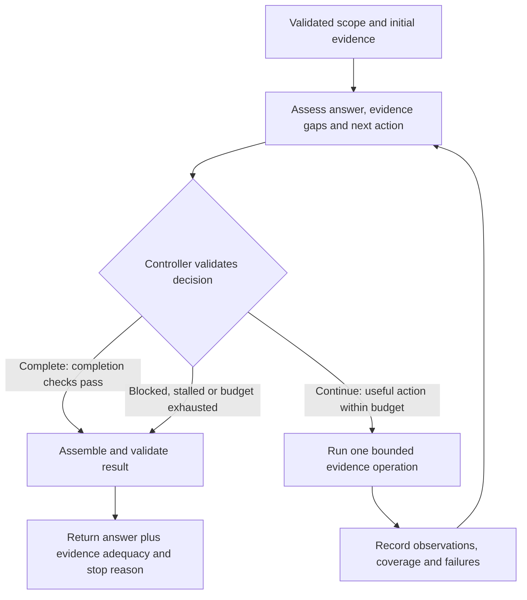

# Minimal completion-aware RCA loop

Date: 2026-09-17. Design sketch only; no runtime implementation or accuracy claim.

Use one agent, one accumulating evidence state, and one bounded tool call per
iteration. The agent assesses the state **before returning or choosing more
work**. Its decision is `complete`, `continue`, or `blocked`. The controller
validates that decision and enforces resource limits.



## What to borrow

The companion [source review](minimal-agent-loop-sources.v1.md) records current
deep research implementations and the exact source links. Borrow their iterative
research, explicit finish decision, bounded execution, and final synthesis.
Collapse planning and reflection into a single assessment call. For this toy,
omit delegation, a task graph, a vector store, and a separate critic model.
These are design choices for SymbolicRCA, not a claim that this toy reproduces
the performance of those systems.

## Smallest state and decision

Keep only four pieces of state:

- `scope`: incident window, deployment, requested fields and incident count.
- `evidence`: observations with stable IDs, source pointers and coverage limits.
- `draft`: associated incident tuples, supports, contradictions and unresolved alternatives.
- `attempts_and_budget`: operation requests/results, failures and remaining work/time/cost.

Each agent assessment returns a structured record:

```python
Assessment(
    decision="continue",           # complete | continue | blocked
    draft=updated_incident_tuples,
    evidence_ids=["e1", "e4"],
    gap="Replica pressure or a shared dependency problem?",
    next_action=compare_replica_metrics(...),  # only for continue
    stop_reason=None,               # concrete reason if blocked
)
```

The same model both updates the draft and assesses it. This is a practical
self-check, not an independent correctness oracle. Code checks identities,
evidence references, legal operations and limits; causal adequacy still needs
evaluation against controlled cases and held-out results.

## The return gate

| Decision | Required check | Result |
|---|---|---|
| Complete | Requested fields/count can be legally assembled; each selected incident has a source-backed explanation; material contradictions and plausible alternatives are addressed; no remaining gap prevents the requested conclusion | Return with evidence adequacy and remaining qualifications |
| Continue | A named evidence gap and one legal, affordable operation whose possible results could affect the answer or its adequacy | Execute, append result, assess again |
| Blocked | A specific missing capability/source, exhausted useful actions, persistent provider failure, stalled investigation, or exhausted budget | Return the best available result with that limitation |

“Addressed” does not mean inventing evidence to rule everything out. An alternative
may remain explicitly unresolved; if it materially prevents choosing the requested
answer, the investigation cannot claim evidential completion. A large metric
deviation, duplicated evidence, or the model saying “confident” is insufficient.

Distinguish `missing_source`, `no_useful_action`, `stalled`, `provider_failure`,
and `budget_exhausted`. These describe inability **in this run with these tools**,
not proof that the incident is unknowable. Missing one source is terminal only
when available alternatives cannot resolve the material gap.

## Toy controller

Illustrative pseudocode; helper functions describe proposed contracts.

```python
state = prepare_or_load_fixture(instruction)  # validate scope first
stop_reason = None

while True:
    if not can_afford_assessment(state, reserve="finalization"):
        stop_reason = "budget_exhausted"
        break

    assessment = assess_bounded(state)  # bounded provider/format repairs
    if assessment.failed:
        stop_reason = "provider_failure"
        break
    retain_valid_draft_and_assessment(state, assessment)

    if assessment.decision == "complete" and completion_checks_pass(state):
        stop_reason = "evidence_sufficient"
        break
    if assessment.decision == "blocked" and blocker_is_supported(state):
        stop_reason = assessment.stop_reason
        break
    if no_useful_actions_remain(state) or stalled(state):
        stop_reason = "no_useful_action" if not stalled(state) else "stalled"
        break
    if not can_afford_action_and_reassessment(state):
        stop_reason = "budget_exhausted"
        break

    # Invalid decisions/actions become recorded feedback and consume an attempt.
    result = execute_or_reject_one(assessment.next_action, state)
    append_result_and_charge_attempt(state, result)

return assemble_validate_and_report(state, stop_reason)
```

Start with **three attempted follow-up operations**, at most **four assessment
calls**, and no hidden unbounded retries. Invalid calls and bounded repair calls
consume the declared limits. Reserve capacity for reassessment after each tool
result and for deterministic finalization; enforce timeouts as well as counts.
These are toy defaults, not empirically selected production limits.

Reject an identical operation against the same immutable source/policy/scope
unless retrying a recorded transient failure. As a toy stall rule, stop after two
consecutive attempts produce neither new evidence/coverage information nor a
resolved gap. A valid empty selection or newly established missing source can
be progress. Rewording a hypothesis or increasing self-reported confidence is not.

## Fit to this project

Place the future controller behind the existing
`solve(instruction, dataset_dir, ctx) -> Solution` seam. Use prepared fixture
packets first; later connect the declared retrieval, comparison, relationship and
targeted-log operations from [ADR 0006](../adr/0006-bounded-investigation-operations.md).
The shipped submission agent is a placeholder; these tool capabilities must not
be assumed implemented merely because their specifications exist.

Per [ADR 0007](../adr/0007-evidence-backed-incident-diagnosis.md), valid judged
cases require a legal best guess even when the loop is blocked. Keep the loop's
`stop_reason` separate from the contract's `completed/degraded/failed` execution
status and `supported/qualified/insufficient` evidence adequacy. Budget exhaustion
does not itself make evidence insufficient or erase an already supported draft.
Conversely, formatting a legal answer never establishes evidential completion.
Invalid scope or impossible legal assembly produces an explicit failed case.
Finalization must work from retained state without requiring another live model
call, and must preserve uncertainty in the evidence artifact.

For a first demonstration, use a synthetic case with two explanations: one
replica has resource pressure, or a shared dependency is slow. The initial packet
leaves that distinction open. One scoped comparison adds discriminating evidence;
the next assessment either completes a supported answer or names the remaining
gap. If identity mapping needed for the requested component cannot be recovered,
stop with that limitation rather than inferring the replica from a nearby metric.

Before live integration, exercise five scripted trajectories: initially sufficient
evidence (zero tools), one useful follow-up then completion, missing evidence with
no available resolution, repeated non-progress, and exhausted/provider budget.
Verify that each terminates with the right reason, retains observed facts, and
never upgrades a forced best guess into supported completion. This validates the
controller's behavior; it does not measure real diagnosis quality.
